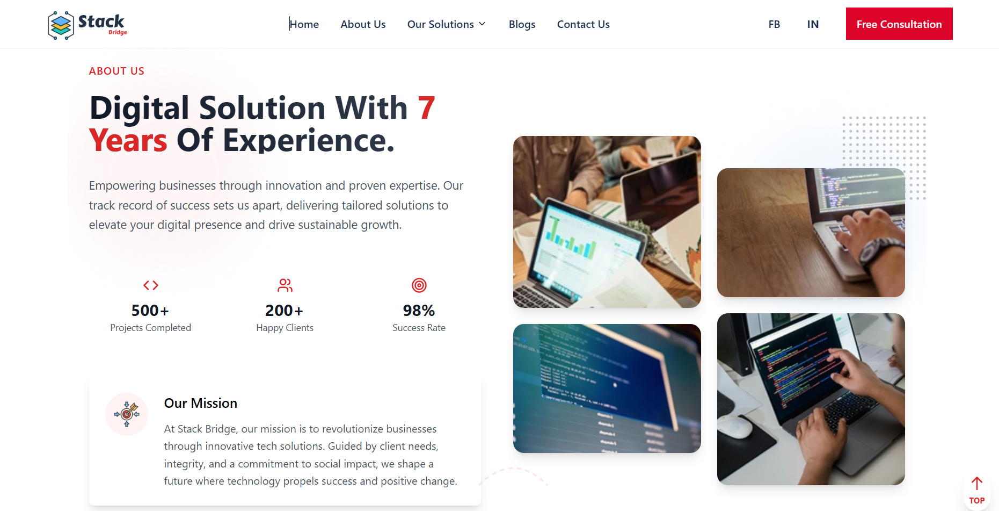
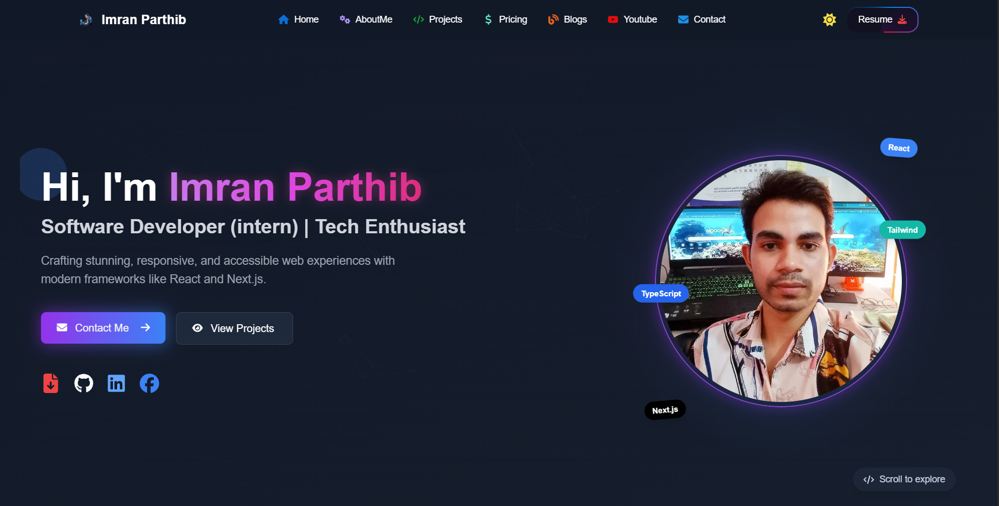

# **My Dev Archive** 🚀

A well-organized collection of **Latest Projects** and **Practice Projects**, showcasing my expertise in JavaScript, React, Tailwind, and more. This repository highlights my ability to create functional and visually appealing applications.

---

## **Table of Contents**

1. [Latest Projects](#latest-projects-)
2. [Portfolio Proejcts](#portfolio-projects-)

## **Latest Projects** 🚀

These are my advanced and polished projects, showcasing full functionality and design.

<table>  
  <thead>  
    <tr>  
      <th>Project Name</th>  
      <th>Tools</th>  
      <th>Live Demo</th>  
      <th>Code</th>  
      <th>Screenshot</th>  
    </tr>  
  </thead>  
  <tbody>  
    <tr>  
      <td><strong>PiLab</strong></td>  
      <td>  
          
          
          
          
      </td>  
      <td></td>  
      <td></td>  
      <td></td>  
    </tr>  
    <tr>  
      <td><strong>StackBridge</strong></td>  
      <td>  
          
          
          
          
          
      </td>  
      <td></td>  
      <td></td>  
      <td></td>  
    </tr>  
    <tr>  
      <td><strong>DEVX </strong></td>  
      <td>  
          
          
          
            
      </td>  
      <td></td>  
      <td></td>  
      <td></td>  
    </tr> 
    <tr>  
  <td><strong>Exam-Timer</strong></td>  
  <td>  
      
      
      
      
  </td>  
  <td></td>  
  <td></td>  
  <td></td>  
</tr>
<tr>  
  <td><strong>Tailus Feedus</strong></td>  
  <td>  
      
      
  </td>  
  <td></td>  
  <td></td>  
  <td></td>  
</tr>
<tr>  
  <td><strong>Panda Commerce</strong></td>  
  <td>  
      
      
      
      
  </td>  
  <td></td>  
  <td></td>  
  <td></td>  
</tr>
<tr>  
  <td><strong>EasyTech</strong></td>  
  <td>  
      
      
      
      
  </td>  
  <td></td>  
  <td></td>  
  <td></td>  
</tr>

  </tbody>  
</table>

---

## **Portfolio Projects** 🎨

These are my portfolio projects that showcase my skills and creativity.

<table>
  <thead>
    <tr>
      <th>Project Name</th>
      <th>Tools</th>
      <th>Live Demo</th>
      <th>Code</th>
      <th>Screenshot</th>
    </tr>
  </thead>
  <tbody>
    <tr>  
      <td><strong>Portfolio V1</strong></td>  
      <td>  
          
          
          
          
      </td>  
      <td></td>  
      <td></td> 
      <td></td>
    </tr>
    <tr>  
  <td><strong>Portfolio V2</strong> 🚧</td>  
  <td>  
      
      
      
  </td>  
  <td></td>  
  <td></td>  
  <td></td>
</tr>

<tr>  
  <td><strong>Portfolio V3</strong> 🚀</td>  
  <td>  
      
      
      
  </td>  
  <td></td>  
  <td></td>  
  <td></td>
</tr>

  </tbody>
</table>

---

## **App Development Projects** 📱

A showcase of applications developed for mobile or cross-platform environments.

<table>
  <thead>
    <tr>
      <th>Project Name</th>
      <th>Tools</th>
      <th>Live Demo</th>
      <th>Code</th>
      <th>Screenshot</th>
    </tr>
  </thead>
  <tbody>
    <tr>  
  <td><strong>Calculator App</strong></td>  
  <td>  
      
      
      
  </td>  
  <td></td>  
  <td></td>  
  <td></td>  
</tr>

  </tbody>
</table>
